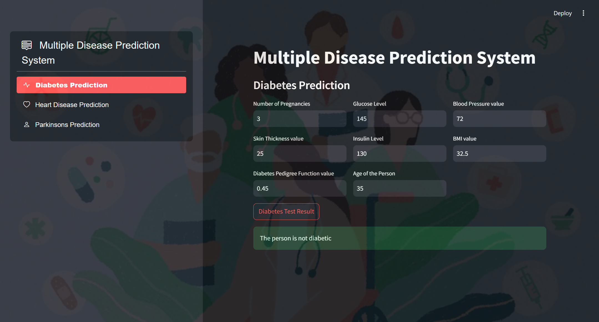
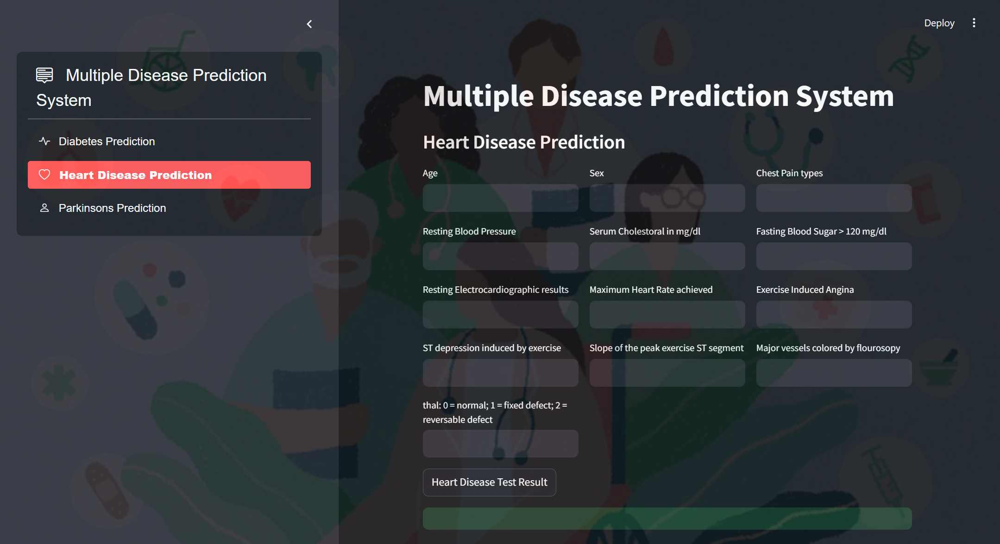
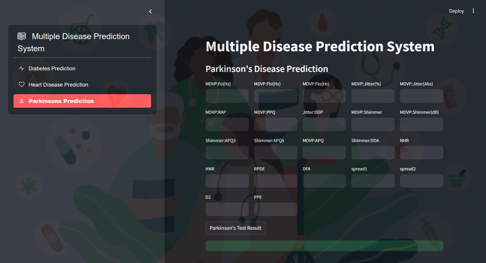

# 🩺 Multiple Disease Prediction System

The **Multiple Disease Prediction System** is a machine learning-based web application that helps users assess the likelihood of three major diseases—**Diabetes**, **Heart Disease**, and **Parkinson’s Disease**—by analyzing medical input data. Built with **Python** and **Streamlit**, it offers quick insights through pre-trained ML models.

---

## 🧠 Tech Stack

- **Frontend/UI**: Streamlit  
- **Language**: Python  
- **Libraries**: Pandas, NumPy, scikit-learn, joblib, matplotlib  
- **Models**: Trained ML classifiers for each disease (e.g., SVM, Random Forest)

---

## 🚀 Features

- ✅ Predicts risk for:
  - Diabetes
  - Heart Disease
  - Parkinson’s Disease
- 🧾 Simple input forms for user health data
- 📈 Displays prediction outcomes instantly
- 🖥️ Lightweight Streamlit interface, no tech skills needed

---

## 🛠️ Installation

### Requirements:
- Python 3.7+
- pip (Python package installer)

### Step 1: Clone the Repository

```bash
git clone https://github.com/xHarshit/Multiple-Disease-Prediction-System.git
cd Multiple-Disease-Prediction-System
```

### Step 2: Install Dependencies

```bash
pip install -r requirements.txt
```

### Step 3: Run the App

```bash
streamlit run multiplediseaseprediction.py
```

Then, open the URL shown in the terminal (usually http://localhost:8501) in your browser.

---

## 🖼️ Screenshots

**1. Diabetes Prediction Interface**  


**2. Heart Disease Prediction Interface**  


**3. Parkinson's Disease Prediction Interface**  


---

## 🧪 How It Works

1. User selects the disease type (Diabetes, Heart, Parkinson).
2. Inputs personal and medical data via form fields.
3. Application processes data using a pre-trained ML model.
4. Displays prediction result — **Likely** or **Unlikely** to have the disease.

---

## 📈 Future Improvements

- Add more diseases (e.g., lung cancer, Alzheimer's)
- Improve model accuracy with larger, more diverse datasets
- Add confidence intervals or explanation (XAI)
- Enable model retraining from within the app

---

## 🪪 License

This project is licensed under the [MIT License](LICENSE). Feel free to modify and use the code for both personal and commercial purposes.
